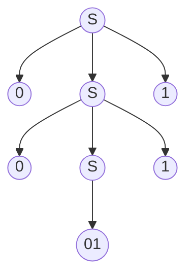
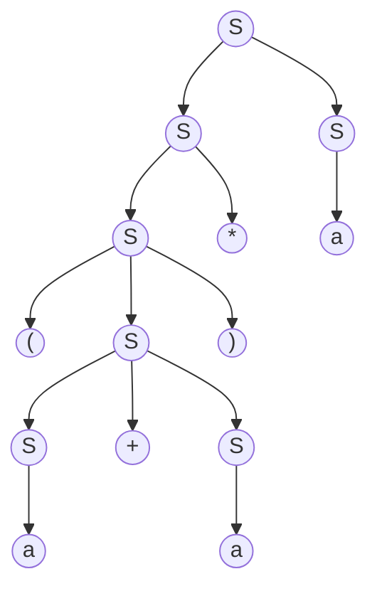

# 简单的翻译器

> 本节依然是一个对于后文编译技术的总体介绍, 相关代码及代码使用方式见 [chapter2](https://github.com/luzhixing12345/compile-principle/tree/main/src/chapter2)

起点不要太高, 我们首先完成一个能够将**中缀算术表达式转换为后缀表达式**的语法制导翻译小程序, 然后我们尝试扩展这个翻译器使其可以翻译一些程序片段

后缀表达式是一种将运算符置于运算分量之后的表示方法.例如,表达式 `9-5+2` 的后缀形式是 `95-2+`. 将表达式翻译为后缀形式的过程可以充分演示语法分析技术,同时这个翻译过程又很简单. 我们先做一些简化

1. 输入仅有数字 + -
2. 数字只考虑单个字符, 即 0-9

当然, 如果只是完成这个任务, 这似乎变成了一道小的算法题, 我们将介绍一种用于描述程序设计语言语法的表示方法: 上下文无关文法(简称"文法")来组织和处理编译器前端

## 上下文无关文法

编译器以简洁的方式指定编程语法,简称文法. 上下文无关文法由 **终结符** **非终结符** **开始符号** **产生式**组成

> 英文释义为context free grammar, 简称CFG

### 什么是终结符?

终结符可以理解为不可再分的最小结构,可以直接表示的字符,比如 + - , ( 等字符

终结符并不仅局限于单个字符,单词也可以是终结符, 包括但不限于 if else for ; sum main function1 等

零终结符即为空串, 记为 `ε`

### 什么是非终结符?

非终结符可以理解为一个组合情况,非终结符可以由终结符组成,也可以由其他非终结符组成. 非终结符有时也称为语法变量, 表示还需要被继续解析下去

比如中缀表达式的文法如下, 其中除了 "+ - 0-9"是终结符, 其余的 list digit 是非终结符

```grammar
list  -> list + digit
list  -> list - digit
list  -> digit
digit -> 0 | 1 | 2 | 3 | 4 | 5 | 6 |7 | 8 | 9
```

这一组为当前文法的产生式集合, 每一行是一个产生式. 每个产生式由三部分组成: 左侧 -> 右侧

- 这里的 → 代表产生/推导,即左侧可以推导出右侧.
- **所有左侧的一定都是非终结符**
- 右侧可能是终结符可能是非终结符,或者是组合, 这里的 expression term factor 是非终结符, `+ - * / 0-9 ()` 都是非终结符

> 有点类似于递归调用的感觉,终结符就像是递归的出口/递归的终止条件

再举一个例子, 对于 C 和 Java 当中的参数调用, 其产生式文法如下所示

```grammar
call      -> id(optparams)
optparams -> params | ε
params    -> params, params | param
```

这个文法就可以匹配类似, max(1,2), func("hello", 1) 之类的格式

> 这个文法并不完整, 比如 id param 的产生式都没有给出, 只是一个示例

再比如C类编程语言最常见的表达式

```grammar
stmts -> stmts stmt
       | ε
stmt  -> id = expression;
       | if (expression) stmt
       | if (expression) stmt else stmt
       | while (expression) stmt
       | do stmt while (expression);
       | {stmt}
```

> 这里分号的位置很巧妙, 对于 stmt 结尾的语句由于是递归的推导, 所以不需要加;

### 为什么叫上下文无关文法?

> 这是一个很有趣的问题, 我之前一直没有思考过为什么叫上下文无关, 主要参考[如何理解上下文无关文法](https://www.zhihu.com/question/21833944/answer/307309365)

上下文无关体现在根据一个产生式 `V->a|b` 我始终可以根据 V 推出 a 和 b 两种情况, 与上下文无关.

举一个上下文无关文法的例子

```grammar
Sent -> S V O
S -> 人 | 天
V -> 吃 | 下
O -> 雨 | 雪 | 饭 | 肉
```

其中英文字母都是非终结符(SVO 分别表示主谓宾),汉字都是终结符.这个文法可以生成如下句子(共 2\*2\*4=16 种组合, 人吃饭,天下雨,人吃肉,天下雪,人下雪,天下饭,天吃肉,……)

可以看到,其中有一些搭配在语义上是不恰当的,例如"天吃肉".其(最左)推导过程为:

Sent -> SVO -> 天VO -> 天吃O -> 天吃肉

但是上下文无关文法里,**因为有"V -> 吃 | 下"这样一条产生式,V 就永远都可以推出"吃"这个词,它并不在乎应用"V -> 吃 | 下"这个产生式进行推导时 V 所在的上下文**(在这个例子里,就是"天VO"中 V 左右两边的字符串"天"和"O").事实上,在 V 推出"吃"这一步,它的左边是"天"这个词,而"天"和"吃"不搭配,导致最后的句子读起来很奇怪

对于上下文有关文法:

```grammar
Sent -> S V O
S -> 人 | 天
人V -> 人吃
天V -> 天下
下O -> 下雨 | 下雪
吃O -> 吃饭 | 吃肉
```

而**上下文有关文法就是左侧不仅只有一个非终结符,还可能有其他终结符/非终结符参与上下文的影响**,相当于加了一些约束条件.

可以看到,这里对 V 的推导过程施加了约束:虽然 V 还是能推出"吃"和"下"两个词,但是仅仅当 V 左边是"人"时,才允许它推导出"吃";而当 V 左边是"天"时,允许它推导出"下".**这样通过上下文的约束,就保证了主谓搭配的一致性.类似地,包含 O 的产生式也约束了动宾搭配的一致性.这样一来,这个语言包含的句子就只有｛人吃饭,天下雨,人吃肉,天下雪｝这四条**,都是语义上合理的.以"人吃饭"为例,推导过程为:Sent -> SVO -> 人VO -> 人吃O -> 人吃饭

---

对于上下文无关文法有一些默认的规定:

- 小写字母如 a b c,运算符号如 + *,标点符号如 , ; 数字默认是终结符
- 大写字符 A B C, 小写的单词如 expr,stmt为非终结符
- 如果需要构造非终结符优先考虑使用 E T F或者相同字符的 S' T'等
- S 默认是开始符号

比如写一个文法 `E -> bTeS` 那么这里的 `E T S` 大写字符默认应该表示的是一个非终结符, `b e` 则表示对应的终结符

## 文法的推导

**根据文法推导符号串时首先从开始符号出发, 不断地将某个非终结符替换为该终结符的某个产生式个体, 可以从开始符号推导得到的所有终结符号串的集合称为该文法定义的语言**

**最左推导**: 始终选择每个句型中的最左非终结符号

**最右推导**: 始终选择每个句型中的最右非终结符号

例1: S -> +SS | *SS | a

对于字符串 `+*aaa` , 推导过程如下

```txt
最左推导    最右推导
S->+SS      S->+SS
S->+*SSS    S->+Sa
S->+*aSS    S->+*SSa
S->+*aaS    S->+*Saa
S->+*aaa    S->+*aaa
```

例2: S -> S+S | SS | (S) | S\* | a

对于字符串 `(a+a)*a` , 推导过程如下

```txt
最左推导        最右推导
S->SS           S->SS
S->S*S          S->Sa
S->(S)*S        S->S*a
S->(S+S)*S      S->(S)*a
S->(a+S)*S      S->(S+S)*a
S->(a+a)*S      S->(S+a)*a
S->(a+a)*a      S->(a+a)*a
```

但是这里有一个问题

这里的最左/最右推导其实是我们**用眼睛直接看出来的**,先观察要推到的结果串的大致格式,然后从S开始推测可能的匹配方式,相当于你是站在了上帝视角拥有了头脑演算回退的方式进行分析,从而直接写出了最后的推导式

但实际上如果是想要编程实现这个问题可并不容易,比如例2中的最左推导的第二步,如果我没有事先注意到后面有一个*那么我很可能就会直接选择S->(S)S,这样推导下去就会失败,需要再重新回退,选择下一个匹配方式.

实际上出现这个问题的原因在于**文法出现了左递归**,我们会在后文优化这个文法以消除左递归

## 构建语法树

构建语法树的过程就是不断推导非终结符,最后得到的终结符组成目标串的过程

例3: S -> 0S1|01

对于字符串 `000111`



例4: S -> S+S | SS | (S) | S\* | a 

对于字符串 `(a+a)*a`



语法树,也称语法分析树/分析树,是用来推导可表达的树状结构,和推导所用的顺序无关(最左最右或其他)

- 树中的每个节点代表非终结符
- 每个叶子节点代表终结符
- 每一步推导代表如何从双亲节点生成它的直接孩子节点

以上两种情况就是一棵完整的语法树的构建方式,既是最左推导也是最右推导,与顺序无关.

**但有的时候你可能会发现不止有一种语法树的构建方式**

例5 : S -> S(S)S|ε

对于字符串 `(()())`, 我们可以先展开到这一步,此时的语法树如下


这时我们发现,最下层的左右两个 S 都可以一个展开为一个括号,另一个变为ε,这样就得到了两棵不同的语法树

|语法树1|语法树2|
|:--:|:--:|
|||

**两棵不同的语法树都是正确的**, 则说明文法出现了二义

## 二义性

文法的二义性的定义是: 文法 G 对同一句子产生不止一棵分析树,则称 G 是二义的

例6:
> E -> id | E+E | E*E

对于这个文法,如果需要匹配的字符串为 `3+4*5`,有两种方式生成语法树

|语法树1|语法树2|
|:--:|:--:|
|||

例7:
> S -> if a B | if a B else B | C

对于这个文法,如果需要匹配的字符串为 `if (a==1) if (b==2) X else Y`

|语法树1|语法树2|
|:--:|:--:|
|||

那么二义性会造成什么问题呢? **分析树的含义取决于树的后序遍历**,对于例6中的 `3+4*5`,树1的含义为 `3+(4*5)`,而树2的含义为`(3+4)*5`,这显然是两种不同的算数运算结果, 即我们没有考虑运算符优先级以及结合性的问题

对于例7,树1中的else与第二个if结合,树2中的else和第一个if结合,相信熟悉编程的同学一定遇到过ifelse错误匹配的错误执行结果

那么显然我们并不希望一个文法有二义性,我们希望通过此文法生成的语法树总是确定的,唯一的.如果一个文法有二义性那么可能不同的编译器在做处理的时候会有不同的结果,这显然是我们不希望看到的

因此为了考虑运算符的优先级, 我们需要重写文法

```grammar
expression -> expression + term
expression -> expression - term
expression -> term
      term -> term * factor
      term -> term / factor
      term -> factor
    factor -> (expression)
    factor -> digit
    digit -> 0 | 1 | 2 | 3 | 4 | 5 | 6 |7 | 8 | 9
```

上面这个例子就是四则运算的上下文无关文法, 你可以在后面的文章中找到如何为此文法编写代码以实现四则运算(带括号)的表达式计算

除了这种拆开的写法, 我们还可以使用 `|` 将相同的左侧非终结符相同产生式进行合并

```txt
expression -> expression + term | expression - term | term
      term -> term * factor | term / factor | factor
    factor -> (expression) | 0-9
```

或者做一下排版

```txt
expression -> expression + term
            | expression - term
            | term
      term -> term * factor
            | term / factor
            | factor
    factor -> (expression)
            | 0-9
```

这里比较有趣的一个点是, 因为 \*/ 比 +- 的优先级更高, 所以它在文法中的位置更低. 考虑 `1 + 2 * 3 + 4` 的语法推导过程

```txt
expression -> expression
expression -> expression + term
expression -> expression + term + term
expression -> term + term + term
expression -> factor + term + term
expression -> 1 + term + term
expression -> 1 + term * factor + term
expression -> 1 + factor * factor + term
expression -> 1 + 2 * factor + term
expression -> 1 + 2 * 3 + term
expression -> 1 + 2 * 3 + factor
expression -> 1 + 2 * 3 + 4
```

其中第五行可以发现整个表达式被替换为了 term + term + term, 也就是按照 + 进行了分割, 相当于需要优先计算 \*/ 并将结果封装为 term 返回, 从语义上体现为 \*/ 的优先级更高, 从文法上体现为优先级更高的操作处于更底层的产生式

> 读者可能对 expression term factor 这样的表述不是很习惯, 后面还会出现一些比如 stmt (statement) 之类的术语, 属于编译原理的常见术语

## 二义性的判断和消除

> 这里书中没有展开过多的讨论, 笔者这里稍微展开一下

如何判断一个文法是否具有二义性?

答: **目前没有通用的办法**

如果想要证明一个文法具有二义性,那么我们只要举出一个反例即可. 比如你想要证明能被3整除的一定能被2整除,你可以举例9,不成立,所以证明为假.

如果想要证明一个文法不具有二义性,那么相当于想要证明任意一大于5的整数都可以写成三个质数之和(哥德巴赫猜想),你需要一套非常完善的数学推导来证明.

非常遗憾目前并没有一个通用的算法可以用来判断一个文法是否具有二义性. 目前的解决办法是: 观察这个文法,如果能找到一个例子可以构建出两个不同的语法树,那么这个文法一定是有二义性的

但是这种判断方式存在两个问题:

1. 我如何去找到这个例子?

   之前提到的文法: `S -> S+S | SS | (S) | S* | a` 如果对于例子 `(a+a)*a`, 确实只有一棵唯一的语法树. 
   
   但是如果对于例子 `aa+aa`,可以构建出不同的语法树, 因为可以选择先展开为SS也可以选择先展开为S+S
 
   也就是说对于同一文法,有的句子会有多课语法树,有的句子只有一棵语法树,这就需要我们头脑机灵一些,不断尝试,寻找一些可能会出现问题的字符串组合

2. 我没找到这个例子也不一定是没有二义性,也可能是我例子寻找的不太好啊?

   确实,这个问题确实.

   其实我上面介绍的两个例子,例6例7就是最为常见的可能造成二义性的两个方面(运算符优先级,替换展开不明/else悬挂)我们可以从这两个角度来思考检查文法,来尝试创造可能有二义性的句子

   归根结底我们无法直接证明一个文法有无二义性,只能凭借直觉猜测和使用例子尝试

   - 如果文法逻辑直观明确, 比如例3的`S->0S1|01`,这明显就是推导一个 0^n1^n 的字符串,显然是没有二义性的
   - 如果文法比较复杂,+\*等多种运算符同时出现在相同的位置上,且前后可推导语句差距不大,比如`S+S`,`S*S`这种,你可能就需要考虑构造一个 `1+2*3`语句会不会造成二义性
   - 如果题目给你一个例子让你说明文法的二义性,那么只需要构造语法树,观察可能在不同的位置进行推导展开,构造出两个语法树即可证明

对于二义性文法如何消除二义性?

答: **没有通用办法**

正如我们无法判断是否有二义性,也就不存在可以消除二义性的办法,要不然岂不是直接就互通了,解决一个两个就都解决了~

目前消除二义性的办法仍然是肉眼观察,使用等价的文法重写

- 对于例6 `E -> id | E+E | E*E` ,该文法造成二义性的原因是`+ *`的计算次序,现在这两个推导是同等级的,那么我们的等价文法就需要提高 `*`的优先级
  
  文法可改写为等价文法:

  ```txt
  E -> E+T|T
  T -> T*F|F
  F -> id
  ```

  这样做的效果是优先考虑 `+` ,这样整个式子会被优先拆解为使用+分割的几个句子,例如 `4*7+4*2+1`,
  该文法会将其分解为 `4*7` `+` `4*2+1`,这里的前半部分的 `4*7` 就被带入T进行下一级的乘法拆解了,后半部分的分解同理,会被分解为 `4*2` `+` `1`.

  正是因为乘法的优先级高,所以我们将加法优先处理,这样分解到下层的就是乘法,在后续遍历中就可以优先计算,得到的结果返回上层再做加法运算.

- 对于例7 `S -> if a B | if a B else B | C`

  等效文法为:

  ```txt
  S  -> S1|S2
  S1 -> if a S1 else S2 | C
  S1 -> if a S1 else S2 | if a else S
  ```

  这种文法的改写不是很好解释,见过,记住就好.

- 对于例5: S -> S(S)S|ε

  等效文法为: S -> S(S) | ε 或者 S-> (S)S|ε

  这样做的原因是因为它出现二义性的原因就是对于多重括号的匹配展开方式有左右两种选择,但是实际上并不需要那么多S作为子推导,我们可以消去一个S,文法仍然等效

## 习题

> [dragon-book-exercise-answers 2.2](https://github.com/fool2fish/dragon-book-exercise-answers/blob/master/ch02/2.2/2.2.md)


```grammar
1. E   -> E E op | num
   op  -> + | - | * | /
   num -> 0 | 1 | 2 | 3 | 4 | 5 | 6 |7 | 8 | 9

2. list -> list , id | id

3. list -> id , list | id

4. expr -> expr + term | expr - term | term
   term -> term * factor | term / factor | factor
   factor -> id | num | (expr)

5. expr -> expr + term | expr - term | term
   term -> term * unary | term / unary | unary
   unary -> + factor | - factor | factor
   factor - > id | num | (expr)
```

其中第二问第三问可以对比一下, 左结合即后将id抛出, 右递归即优先将id抛出

2.2.6 为罗马数字构建一个个上下文无关文法

> [Roman numerals](https://en.wikipedia.org/wiki/Roman_numerals)

罗马数字的基本构成如下, 大致分为四组

```txt
I, II, III | I V | V, V I, V II, V III | I X
```

因此就单字符(0-9)的可以写出如下的产生式

```grammar
digit      -> smallDigit | I V | V smallDigit | I X
smallDigit -> I | II | III | ε
```

更多的1000,100,10的实际上是类似的规律,只是字符变为MDC,因此完整规则如下

```grammar
romanNum     -> thousand hundred ten digit
thousand     -> M | MM | MMM | ε
hundred      -> smallHundred | C D | D smallHundred | C M
smallHundred -> C | CC | CCC | ε
ten          -> smallTen | X L | L smallTen | X C
smallTen     -> X | XX | XXX | ε
digit        -> smallDigit | I V | V smallDigit | I X
smallDigit   -> I | II | III | ε
```

## 左递归

前面列出了一些文法以及对应的推导过程, 相信会有部分读者可能跃跃欲试想要写点代码实现一下推导过程, 但如果真的按照给出的文法会发现不可能做到

例 1: 假设有如下文法,用于表示算术运算的匹配.

```txt
E -> E + T | E - T | T
T -> T * F | T / F | F
F -> (E) | id
```

如果使用最左推导匹配 `1+2*3`, 虽然我们很容易看出来应该如何匹配, 但是由于最左推导一定会选择匹配的第一个产生式进行分解

所以分解的结果如下

```
E->E+T
E->E+T+T
E->E+...+T+T
```

这种分解永无止境,直到栈空间溢出程序退出,颇有循环递归没有终止条件无限递归调用下去的感觉,由于语法分析是从左到右依次进行的,所以也被成为**左递归**

考虑到我们需要编写程序来帮助我们执行语法分析的过程,所以我们需要**消除左递归以避免递归的爆栈**, 这样程序就可以根据当前终结符来判断当前的推导式是否合理,如果不合理就选下一个推导式,如果没有可选的推导式了那就回退到上一步,选择下一个推导式再推导.

消除左递归的意义就在于防止程序进入死递归,即产生式的最左侧一定不是与它相同的非终结符.

### 直接左递归

直接左递归即 A -> Aα | β,该文法可以生成的字符串为 β, βα, βαα...

即最后推导的结果为 β(α)^*

所以该文法的等价文法为

```grammar
A  -> βA'
A' -> αA' | ε
```

对于例 1:

```txt
E -> E + T | E - T | T
T -> T * F | T / F | F
F -> (E) | id
```

我们将相同符号A之后的全部看作α, 不包含的看作β. 上式可以转化为如下的形式

```txt
E  -> TE'
E' -> +TE'|-TE'|ε

T  -> FT'
T' -> *FT'|/FT'|ε

F  -> (E) | id
```

如果直接左递归的部分十分复杂, 多个α和β都出现了, 将 A 后面的元素看作α,将与之并列的看作β,该推导式就可以推广, 以此得到一个通用的消除直接左递归的方法,

P -> Pα1 | Pα2 | Pαn | β1 | β2 | βm

那么实际上的消解式仍然不变, 替换掉直接左递归的符号P为P',然后构建P'的产生式

- P -> β1P' | β2P' | βmP'    
- P'-> α1P' | α2P' | αnP' | ε

比如如下的文法

```grammar
A -> Aa | Ab | c | d
```

可以被转换为

```grammar
A  -> cA' | dA'
A' -> aA' | bA' | ε
```

### 间接左递归

除了比较容易观察到的直接左递归, 还有一类不容易观察到的间接左递归

间接左递归就是推导式的最左侧是一个非终结符,但是这个非终结符的推导式的首字符还是这个字符

例 2:

```txt
S -> Aa | b
A -> Ac | Sd | ε
```

`S -> Aa -> Sda` 还是存在左递归

解决间接左递归的方法也十分简单,就是带入: 将存在间接左递归的式子带入,即将 S 带入第二个式子

```txt
A -> Ac | (Aa|b)d | ε
```

带入之后由于 S 本身存在两个候选式,所以还需要展开

```txt
A -> Ac | Aad | bd | ε
```

再来消除直接左递归

```txt
A -> bdA' | ε
A' -> cA' | adA' | ε
```

---

实际上还可能出现一些更为复杂的情况

```txt
A -> BD
B -> CA
C -> ε
D -> a
```

上方的文法其中C由于可以推导ε,所以实际上也会产生间接左递归. 也就是说如果首字符的first集中包含ε,那么也要考虑

> first 集的概念会在下面介绍

### 消除左公因子

我们再来做一道题

例 3: S -> SS+ | SS* | a

很显然题目中存在左递归,我们先消除左递归

```txt
S  -> aS'
S' -> S+S' | S*S' | ε
```

这时我们注意到一个问题,虽然消除之后的式子不存在左递归了,但是第二行出现了 `S+S'`和 `S*S'`两个开头字符相同的候选式,这虽然不会造成左递归的死循环,但是我们显然也不希望两个推导式具有完全相同的公共前缀

1. 我们希望每一个推导式具有独立的特征,这样方便我们用眼睛直接观察.
2. 对于编程来说, 相同的前缀符号不利于应该选择哪一个作为推导式,如果选择错误需要回溯
3. 用眼睛观察可以直接看到后面跟的是什么,相当于预判了后面的符号. 但是编程解决问题是无法接受回溯的,非常不利于计算效率,故而我们希望消除左公因子

消除左公因子的方法也十分的简单,就是类似于乘法中的提取公因式

左公因子是 S,所以我们可以提出 S,将两个候选式后面不同的部分单独提出来放到下一级

```txt
S  -> aS'
S' -> ST | ε
T  -> +S' | *S'
```

现在的文法就是消除左递归和消除左公因子之后的式子了!

### 执行顺序

上文我们提到的顺序是 `直接左递归`, `间接左递归`, `左公因子`

实际上代码实现上的消解顺序应该是, `间接左递归`, `直接左递归`, `左公因子`

这是因为**间接左递归的消除采用的是带入展开, 所以会带来新的直接左递归的出现**. 三者都会创造文法中新的非终结符, 且前两者都可能会带来左公因子的出现.

此外左公因子可能会存在多个公共前缀, 比如下面的文法

```txt
S -> T + A | T + B | T - A
```

这里可以看到 `T` 是第一个左公因子, 但消除之后还会出现 `+` 的左公因子. 所以这里需要两步消除, 多出来两个非终结符 C D, 最后文法为

```txt
S -> TC
C -> +D | -A
D -> A | B
```

## 自顶向下和递归下降分析

我们现在使用的文法的推导方式是自顶向下的,它从语法分析树的根节点开始依次创建各个结点.自顶向下的语法分析也可以看作是寻找输入串的最左推导的过程

自顶向下语法分析的关键就是确定一个非终结符 A 到底应该应用哪个产生式,因为一旦选择了某一个 A 的产生式,接下来就会将产生式中的终结符与输入相匹配.

目前我们使用的匹配方法是 `递归下降语法分析`,也就是俗称的递归遍历所有 A 的产生式,如果满足了就递归结束返回找下一个,如果没满足就接着找下一个.也是最原始原朴素的一种匹配方式.

但是这样可能会存在一个小问题,比如说存在一个如下的复杂文法

```txt
S -> A+B+C | D+E+F
A -> E*G+Q | B*S
D -> W+Q-T | S+Q+A
...

```

> 当然,为了描述其不当之处这个文法似乎有些过于复杂了...

不过从中我们可以看出来,如果说文法很复杂,假如说我们要推导的式子是 `2+3*6-1`,这时`2`作为该串的第一个终结符进行判断. 递归下降分析会依次判断候选式的首字符是否满足,当无法直接判断时(比如候选式的首字符是一个非终结符),就继续递归,再判断,再判断.如果递归出来发现没有候选式满足,那还得再回到上层,依次判断下一个候选式,这显然对于文法复杂的语言来说这会严重影响效率.

况且更致命的一点的,你前面的字符都快速的成功匹配了,但是后面突然发现一个字符没有匹配,这时候你不得不疯狂回退,再重新选择候选式,再判断,这种耗时就更加可怕了.**回溯的耗时**是我们需要解决的一个问题.

造成这个问题的 **根本原因** 是因为 不确定当前文法的非终结符应该选择什么 以及 应该选择哪个产生式

我们希望能够找到一个快速的匹配方式, 即对于当前的字符可以清晰的选出使用哪个产生式, 比如说看到了输入是 `(`,我就是知道要匹配 `S -> A+B+C` 然后 `A-> B*S` ... 直接就能一气呵成完全不需要回溯,更好的情况就是我能根据这个文法建立一个表格,对于输入的一个字符,我能通过查表就可以知道应该怎么匹配,这样的效率显然要高得多得多.

## 预测分析法

对于某些文法,我们可以构造出向前看 K 个输入符号的预测分析器,还是刚才那个例子`2+3*6-1`,也就是说我现在的输入符号是`2`,我可以看到向下的 K 个输入.

原理就是我们可以从文法中提取一些规则,然后我们还可以根据输入的字符串预先了解到要输入的形式是什么样子的,这样我们就可以避免回溯判断,直接一步到位选择非终结符的产生式

这种方式就称为`预测分析法`,预测分析法从文法的开始符号出发,在每一步推导过程中根据当前句型的 `最左非终结符A` 和 `当前输入符号a`,选择正确的 A 产生式.

为了保证分析的准确性,**选出的候选式一定是唯一的**, 这也就是为什么我们要先消除左递归和左公因子

怎么预测呢? 其实很简单,就是看**后面能跟什么** 以及 **跟的又是什么**.

比如说有如下文法

```txt
S -> aBC
B -> bC | dB | ε
C -> c | a
```

那我们就可以知道,如果现在串的状态(暂且用"状态"一词表示)是`S`,那么后面只能跟`a`,其他的都是不正确的. 如果检测到`a`了,那状态就变成了`B`.B 开头可以是 `b`和`d`,如果是 b 那就是选择 bC, d 就是 dB. 同时注意到 B 同时也可能为空,所以我们也应该考虑 C 开头字符.

同时我们也应该考虑一个状态的结尾字符都可以是什么,如果这个状态后面可以跟 a|b|ε, 预测发现下一个字符是 d,那我们就直接选择 ε,把判断交给下一个非终结符.

上文提到的 `开头能是什么字符` 和 `后面能跟什么字符` 就是 first 集和 follow 集

## first集

first集的求法比较简单, 就是对于每一条产生式 `A -> XYZ` 依次判断其右侧的推导式 `XYZ`

1. 首先判断出那些是终结符,那些是非终结符
2. 观察右侧的推导式 `XYZ` 
   
   - 如果第一个字符 `X` 是一个终结符, 那么将 `X` 加入 `A` 的first集, **结束**
   - 如果 `X` 是一个非终结符, 那么将非终结符 `X` 的first集的**所有除ε以外的元素**加入到 `A` 的first集
     - 如果 `X` first集中包含ε, 则说明`X`仍可能为空,继续往下判断 `Y`
       - 如果该产生式右侧的最后一个字符 `Z` 并且 `Z` 中仍然包含ε, 则将ε 加入到 `A` 的first集, **结束**
     - 如果 `X` 中不包含ε, **结束**

例 4:

```txt
S -> aS'
S'-> ST | ε
T -> +S' | *S'
```

我们可以求出如下 first 集

| first 集  |       元素        |
| :-------: | :---------------: |
| first(S)  |        {a}        |
| first(S') | {ε,a} |
| first(T)  |      {+,\*}       |

例 5:

```txt
S -> (L)|a
L -> L,S | S
```

先消除左递归,得到

```txt
S -> (L) | a
L -> SL'
L'-> ,SL' | ε
```

然后再计算 first 集

| first 集  |  元素   |
| :-------: | :-----: |
| first(S)  |  {(,a}  |
| first(L)  |  {(,a}  |
| first(L') | {`,`,ε} |

例 7: 例 1 已经消除左递归的式子,略微比之前的复杂一些

```txt
E  -> TE'
E' -> +TE'|-TE'|ε
T  -> FT'
T' -> *FT'|/FT'|ε
F  -> (E) | id
```

| first 集  |   元素   |
| :-------: | :------: |
| first(E)  |  {(,id}  |
| first(E') | {+,-,ε}  |
| first(T)  |  {(,id}  |
| first(T') | {\*,/,ε} |
| first(F)  |  {(,id}  |

如果真的计算 first 集的时候就会发现当我们发现 E 的 first 集元素应该是 T 的 first 集元素,但是现在 T 的 first 集中还没有元素,只有当后面 T 的 first 集更新之后,才能在回过来更新 E 的 first 集.

从代码角度看的话就是一个循环,直到一轮结束之后所有 first 集都没有更新,那么结束循环,否则再次查看有没有需要更新的 first 集

这一点有需要注意, first集虽然只看右侧产生式的首字符,但是还需要注意当这个首字符是非终结符且包含 `ε` 的时候, 还应该继续往下看

## follow 集

first 集和 follow 集通常是一起出现一起考,follow 集的计算和 first 集密不可分,**我们需要先计算所有元素的 first 集之后才能计算 follow 集**

follow 集: 可能在某个句型中紧跟在 A 后面的终结符 a 的集合,如果 A 是某个句型的最右符号则把$也加入 follow 集

对于产生式 `A -> BCDEF`

1. 将 $ 加入到起始元素 S 的follow集中

   这里要注意, $ 只加入到起始元素的follow集中, 表示结尾. 这里的 `A -> BCDF` 只是众多的产生式中的一个, 并不是把 $ 加入到每个产生式左侧的非终结符中!

2. 先观察右侧的 `BCDEF`, 顺序观察遍历
   1. 如果是 `B` 是终结符, 下一个
   2. 如果 `B` 是非终结符
      1. 把 `C` 的first集加入到 `B` 的follow集中, 因为C在B后面,所以B后面肯定可以跟C的开头的字符
      2. 如果 `C` 的first集中包含 ε, 那么接着往下看 `D`, 直到没有 ε. 如果到结尾F了还存在ε, 那么把ε加入到B的first集中, **结束**
   3. 接着看C D E
   4. 如果产生式的结尾 `F` 是一个非终结符, 那么把 `A` 的follow集加入到 `F` 的follow集中

      注意这里一定不要搞反了! 是把 A 的follow加入到 F的follow中

例 5:

```txt
S  -> (L) | a
L  -> SL'
L' -> ,SL' | ε
```

这里的 follow 集的求法分为三步:

1. 先观察某一个非终结符后面有没有直接跟了终结符, 比如 L),那么就把 `)` 加入到 follow(L)
2. 再观察两个非终结符连在一起的, 比如 SL',这种就是 S 后面跟的就应该是 L'的开头,所以把 first(L')加入到 follow(S)
3. 最后一种就是观察一个推导是不是以非终结符结尾, 比如 `L -> SL'`,那么能跟在 L 后面的一定也能跟在 L'后面,follow(L)加入到 follow(L')中.


这里要重点说明一下: `L -> SL'` **是把 follow(L)加入到 follow(L')**,**但是不能把 follow(L')加入到 follow(L)中**
如果说你后续向 follow(L)中追加了其他元素,follow(L')也应该在下一轮中更新

> 当然如果不是写代码而是做题的话就留个心眼记得更新就好了

follow 集的定义就是找到能跟在某一非终结符后面的所有终结符,正是因为 L 具有一个产生式 `L -> SL'`,所以能跟在 L 的 follow 集中的元素一定是 follow(L')中的元素,后续向 follow(L)中追加的元素也应该补充到 follow(L')中

这个式子的左侧非终结符是 L,也就是说现在我们考虑的是 L 对其产生式的影响,能跟在 L 后面的一定可以跟在其产生式后面,所以 follow(L)应该加入到产生式结尾的非终结符的 follow 集中.

我举一个实际一些的例子来理解一下 follow 集的作用,假设有如下文法

```txt
A -> 2CB
B -> 1B | ε
C -> 3C4 | ε
```

可以用眼睛看一看,这个式子表示的含义是推导一个类似 `23^n4^n1^m` 的字符串,开头是 2,结尾是一堆 1,中间是数量相同的 3 和 4

先求 first 集

|  first   | ITEM  |
| :------: | :---: |
| first(A) |  {2}  |
| first(B) | {1,ε} |
| first(C) | {3,ε} |

follow(C)很好求

- C->3C4|ε 可以得到 follow(C) = {4}
- A->2CB 可以得到 follow(C) = {4} + first(B)-ε = {4,1}

所以最后 follow(C) = {$,4,1},表示如果现在的状态是 C,那么后面跟着的不是 1 就是 4

因为 B -> ε,A -> 2CB,所以 follow(A)加入到 follow(C),这是合理的,虽然没啥用

但是你不能把 follow(C)加入到 follow(A)里,A 就是最开始的推导串,哪里有什么其他非终结符作为 follow 呢?

**所以 follow 集的添加是不可逆的**,将 follow(A)加入到 follow(C)中


最后一个补充的就是和 first 集的推导中的提示类似,如果某一个推导可能推导出空串,那么就要注意如果它是空的情况

如果 first 集中含有 ε,那么我们不把 ε 加入到 follow 集.follow 集都是不含 ε 的,因为就算 ε 可以跟在一个非终结符后面,这也没啥意义.

拉的有点远了我们回到这一题


```txt
S -> (L) | a
L -> SL'
L' -> ,SL' | ε
```

| first 集  |  元素   | follow 集  |   元素    |
| :-------: | :-----: | :--------: | :-------: |
| first(S)  |  {(,a}  | follow(S)  | {$,`,`,)} |
| first(L)  |  {(,a}  | follow(L)  |   {$,)}   |
| first(L') | {`,`,ε} | follow(L') |   {$,)}   |

例 7: 例 1 已经消除左递归的式子,略微比之前的复杂一些

```txt
E -> TE'
E' -> +TE'|-TE'|ε
T -> FT'
T' -> *FT'|/FT'|ε
F -> (E) | id
```

| first 集  |   元素   | follow 集  |     元素     |
| :-------: | :------: | :--------: | :----------: |
| first(E)  |  {(,id}  | follow(E)  |    {$,)}     |
| first(E') | {+,-,ε}  | follow(E') |    {$,)}     |
| first(T)  |  {(,id}  | follow(T)  |   {$,+,-}    |
| first(T') | {\*,/,ε} | follow(T') |   {$,+,-}    |
| first(F)  |  {(,id}  | follow(F)  | {$,\*,/,+,-} |

> 怕我没说清楚这里再提一句解释一下

- T -> FT'
- T' -> *FT'|/FT'|ε

这两个推导式可以看出来存在 T'->ε 的产生式,所以不止有 follow(T)加入到 follow(T'),还有 follow(T)加入到 follow(F)

> 这两步都是有的,只不过说如果 follow 集元素重复会去重,没有明显变化罢了

## LL(1)文法

什么是LL1文法?

- 第一个L代表从左至右
- 第二个L代表产生最左推导
- 1代表每一步中只需要向前看一个输入符号就可以决定语法分析动作

之前我们提到了如何计算first集和follow集,既然我们已经知道了在某一状态的开头的字符都是什么,后面跟着字符都可能是什么,那么我们就可以做出预测分析.

由此引出了`可选集-SELECT集`的概念


SELECT集是指选用该产生式时的输入符号的集合


SELECT集的求法也比较简单

- 当产生式非空时,将首终结符加入SELECT集中,如果首字符是非终结符那么将该非终结符的first集加入SELECT集中
- 当产生式为空时,将follow集加入SELECT集中


这里值得注意的一点是,现在得到的文法很有可能是多个 | 连接起来的,在计算SELECT集的时候我们需要把它们都拆开,
比如 A -> aBc | ST | c,应该分解为 A->aBc,A->ST,A->c. 在分别计算它们的SELECT(A->aBc),SELECT(A->ST),SELECT(A->c)

first集和SELECT集中是可以有ε的,只有follow集中没有ε,应该说是没有出现的必要.


对于之前的例子


```txt
S -> (L) | a
L -> SL'
L' -> ,SL' | ε
```


|first集|元素|follow集|元素|
|:--:|:--:|:--:|:--:|
|first(S)|{(,a}|follow(S)|{$,`,`,)}|
|first(L)|{(,a}|follow(L)|{$,)}|
|first(L')|{`,`,ε}|follow(L')|{$,)}|


记得拆开 | 哦~


|SELECT|ITEM|
|:--:|:--:|
|SELECT(S->(L))|{(}|
|SELECT(S->a)|{a}|
|SELECT(L->SL')|{(,a}|
|SELECT(L'->,SL')|{,}|
|SELECT(L'->ε)|{$,)}|

对于具有相同左部的SELECT集,只要它们不相交,那么我们可以根据它SELECT集中的元素唯一的选择一个产生式由于推断,这样就避免了回溯,这就是LL1文法的优势.

这样我们就得到了一个表格,我们可以把它画出来


横坐标中的输入符号就是所有出现在SELECT集后面的元素
纵坐标就是所有的左部的非终结符


|非终结符|(|)|,|a|$|
|:--:|:--:|:--:|:--:|:--:|:--:|
|S|S->(L)|||S->a||
|L|L->SL'|L->SL'|||
|L'||L'->ε|L'->,SL'||L'->ε|


那么这个分析表应该怎么用呢


我们不妨先来做一道题,我会将我的解答放在下面,不过建议你先独立做完这道题再看


1. 试写出 ¬(a→a)$ 的一个最左推导

   ```txt
   F -> ¬F
   F -> ¬(F)
   F -> ¬(F→F)
   F -> ¬(a→F)
   F -> ¬(a→a)
   ```

2. 消除左递归和左公因子

   ```txt
   F -> ¬FT | (F)T | aT
   T -> →FT | ε
   ```

3. 求first集 follow集

   |first|ITEM|follow|ITEM|
   |:--:|:--:|:--:|:--:|
   |first(F)|{¬,(,a}|follow(F)|{$,),→}|
   |first(T)|{→,ε}|follow(T)|{$,),→}|

4. LL1分析表

   |SELECT|ITEM|
   |:--:|:--:|
   |SELECT(F->¬FT)|{¬}|
   |SELECT(F->(F)T)|{(}|
   |SELECT(F->aT)|{a}|
   |SELECT(T->→FT)|{→}|
   |SELECT(T->ε)|{$,),→}|

   |非终结符|¬|(|a|$|)|→|
   |:--:|:--:|:--:|:--:|:--:|:--:|:--:|
   |F|F->¬FT|F->(F)T|F->aT|
   |T||T->ε|T->ε|T->ε|T->ε|T->→FT\|ε|

   当输入为→且非终结符为T时,存在两个产生式,SELECT(T->→FT)与SELECT(T->ε)存在交集.所以不是LL1文法

5. ¬(a→a)的推导过程

   
   推导过程就是一个根据分析表一步步解析,消减的过程,如下
   

   |剩余串|分析栈|分析动作|
   |:--:|:--:|:--:|
   |¬(a→a)$|F$|F->¬FT|
   |¬(a→a)$|¬FT$||
   |(a→a)$|FT$|F->(F)T|
   |(a→a)$|(F)TT$||
   |a→a)$|F)TT$|F->aT|
   |a→a)$|aT)TT$||
   |→a)$|T)TT$|T->→FT|
   |→a)$|→FT)TT$||
   |a)$|FT)TT$|F->aT|
   |a)$|aTT)TT$||
   |)$|TT)TT$|T->ε|
   |)$|T)TT$|T->ε|
   |)$|)TT$||
   |$|TT$|T->ε|
   |$|T$|T->ε|
   |$|$||


## 参考

- [词法分析 | 分析树和二义性文法](https://zhuanlan.zhihu.com/p/31224910)
- [51cto blog](https://blog.51cto.com/luochen2015/1859058)
- [二义性文法的理解和消除方法](https://blog.csdn.net/weixin_44143695/article/details/103229044)
- [2.5.3 文法二义性的消除](https://blog.csdn.net/qq_45180475/article/details/107815080)
