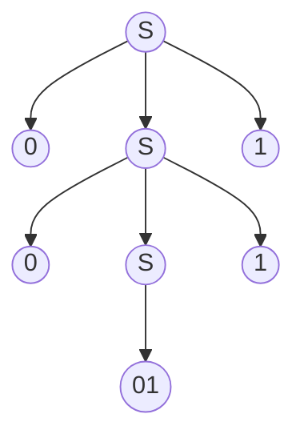
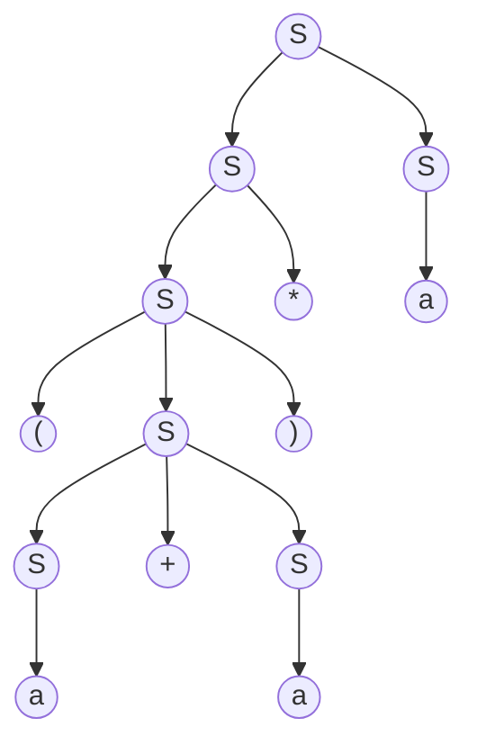

# 简单的翻译器

> 本节依然是一个对于后文编译技术的总体介绍

起点不要太高, 我们首先完成一个能够将**中缀算术表达式转换为后缀表达式**的语法制导翻译小程序, 然后我们尝试扩展这个翻译器使其可以翻译一些程序片段

后缀表达式是一种将运算符置于运算分量之后的表示方法.例如,表达式 `9-5+2` 的后缀形式是 `95-2+`. 将表达式翻译为后缀形式的过程可以充分演示语法分析技术,同时这个翻译过程又很简单. 我们先做一些简化

1. 输入仅有数字 + -
2. 数字只考虑单个字符, 即 0-9

当然, 如果只是完成这个任务, 这似乎变成了一道小的算法题, 我们将介绍一种用于描述程序设计语言语法的表示方法: 上下文无关文法(简称"文法")来组织和处理编译器前端

## 上下文无关文法

编译器以简洁的方式指定编程语法,简称文法. 上下文无关文法由 **终结符** **非终结符** **开始符号** **产生式**组成

> 英文释义为context free grammar, 简称CFG

### 什么是终结符?

终结符可以理解为不可再分的最小结构,可以直接表示的字符,比如 + - , ( 等字符

终结符并不仅局限于单个字符,单词也可以是终结符, 包括但不限于 if else for ; sum main function1 等

### 什么是非终结符?

非终结符可以理解为一个组合情况,相当于一个小函数.非终结符可以由终结符组成,也可以由其他非终结符组成

常见的上下文无关文法一般的表示为:

```txt
expression -> expression + term
expression -> expression - term
      term -> term
      term -> term * factor
      term -> term / factor
      term -> factor
    factor -> (expression)
    factor -> 0-9
```

这一组为当前文法的产生式集合, 每一行是一个产生式. 每个产生式由三部分组成: 左侧 -> 右侧

- 这里的 → 代表产生/推导,即左侧可以推导出右侧.
- **所有左侧的一定都是非终结符**
- 右侧可能是终结符可能是非终结符,或者是组合, 这里的 expression term factor 是非终结符, `+ - * / 0-9 ()` 都是非终结符

> 有点类似于递归调用的感觉,终结符就像是递归的出口/递归的终止条件

上面这个例子就是四则运算的上下文无关文法, 你可以在后面的文章中找到如何为此文法编写代码以实现四则运算(带括号)的表达式计算

除了这种拆开的写法, 我们还可以使用 `|` 将相同的左侧非终结符相同产生式进行合并

```txt
expression -> expression + term | expression - term
      term -> term | term * factor | term / factor | factor
    factor -> (expression) | 0-9
```

或者做一下排版

```txt
expression -> expression + term
            | expression - term
      term -> term
            | term * factor
            | term / factor
            | factor
    factor -> (expression)
            | 0-9
```

同时文法需要指定一个非终结符作为开始符号, 一般是 "S", 上文中是 expression

### 为什么叫上下文无关文法?

上下文无关体现在根据一个产生式 `V->a|b` 我始终可以根据 V 推出 a 和 b 两种情况, 与上下文无关.

举一个上下文无关文法的例子

- Sent -> S V O
- S -> 人 | 天
- V -> 吃 | 下
- O -> 雨 | 雪 | 饭 | 肉

其中英文字母都是非终结符(SVO 分别表示主谓宾),汉字都是终结符.这个文法可以生成如下句子(共 2\*2\*4=16 种组合, 人吃饭,天下雨,人吃肉,天下雪,人下雪,天下饭,天吃肉,……)

可以看到,其中有一些搭配在语义上是不恰当的,例如"天吃肉".其(最左)推导过程为:

Sent -> SVO -> 天VO -> 天吃O -> 天吃肉

但是上下文无关文法里,**因为有"V -> 吃 | 下"这样一条产生式,V 就永远都可以推出"吃"这个词,它并不在乎应用"V -> 吃 | 下"这个产生式进行推导时 V 所在的上下文**(在这个例子里,就是"天VO"中 V 左右两边的字符串"天"和"O").事实上,在 V 推出"吃"这一步,它的左边是"天"这个词,而"天"和"吃"不搭配,导致最后的句子读起来很奇怪

对于上下文有关文法:

- Sent -> S V O
- S -> 人 | 天
- 人V -> 人吃
- 天V -> 天下
- 下O -> 下雨 | 下雪
- 吃O -> 吃饭 | 吃肉

而**上下文有关文法就是左侧不仅只有一个非终结符,还可能有其他终结符/非终结符参与上下文的影响**,相当于加了一些约束条件.

可以看到,这里对 V 的推导过程施加了约束:虽然 V 还是能推出"吃"和"下"两个词,但是仅仅当 V 左边是"人"时,才允许它推导出"吃";而当 V 左边是"天"时,允许它推导出"下".**这样通过上下文的约束,就保证了主谓搭配的一致性.类似地,包含 O 的产生式也约束了动宾搭配的一致性.这样一来,这个语言包含的句子就只有｛人吃饭,天下雨,人吃肉,天下雪｝这四条**,都是语义上合理的.以"人吃饭"为例,推导过程为:Sent -> SVO -> 人VO -> 人吃O -> 人吃饭

---

对于上下文无关文法有一些默认的规定:

- 小写字母如 a b c,运算符号如 + *,标点符号如 , ; 数字默认是终结符
- 大写字符 A B C, 小写的单词如 expr,stmt为非终结符
- 如果需要构造非终结符优先考虑使用 E T F或者相同字符的 S' T'等
- S 默认是开始符号

比如写一个文法 `E -> bTeS` 那么这里的 `E T S` 大写字符默认应该表示的是一个非终结符, `b e` 则表示对应的终结符

## 最左推导 最右推导

**最左推导**: 始终选择每个句型中的最左非终结符号

**最右推导**: 始终选择每个句型中的最右非终结符号

例1: S -> +SS | *SS | a

对于字符串 `+*aaa` , 推导过程如下

```txt
最左推导    最右推导
S->+SS      S->+SS
S->+*SSS    S->+Sa
S->+*aSS    S->+*SSa
S->+*aaS    S->+*Saa
S->+*aaa    S->+*aaa
```

例2: S -> S+S | SS | (S) | S\* | a

对于字符串 `(a+a)*a` , 推导过程如下

```txt
最左推导        最右推导
S->SS           S->SS
S->S*S          S->Sa
S->(S)*S        S->S*a
S->(S+S)*S      S->(S)*a
S->(a+S)*S      S->(S+S)*a
S->(a+a)*S      S->(S+a)*a
S->(a+a)*a      S->(a+a)*a
```

但是这里有一个问题

这里的最左/最右推导其实是我们**用眼睛直接看出来的**,先观察要推到的结果串的大致格式,然后从S开始推测可能的匹配方式,相当于你是站在了上帝视角拥有了头脑演算回退的方式进行分析,从而直接写出了最后的推导式

但实际上如果是想要编程实现这个问题可并不容易,比如例2中的最左推导的第二步,如果我没有事先注意到后面有一个*那么我很可能就会直接选择S->(S)S,这样推导下去就会失败,需要再重新回退,选择下一个匹配方式.

实际上出现这个问题的原因在于**文法出现了左递归**,我们会在下一节中优化这个文法以消除左递归

## 构建语法树

构建语法树的过程就是不断推导非终结符,最后得到的终结符组成目标串的过程

例3: S -> 0S1|01

对于字符串 `000111`



例4: S -> S+S | SS | (S) | S\* | a 

对于字符串 `(a+a)*a`



语法树,也称语法分析树/分析树,是用来推导可表达的树状结构,和推导所用的顺序无关(最左最右或其他)

- 树中的每个节点代表非终结符
- 每个叶子节点代表终结符
- 每一步推导代表如何从双亲节点生成它的直接孩子节点

以上两种情况就是一棵完整的语法树的构建方式,既是最左推导也是最右推导,与顺序无关.

但有的时候你可能会发现不止有一种语法树的构建方式

例5 : S -> S(S)S|ε

对于字符串 `(()())`, 我们可以先展开到这一步,此时的语法树如下


这时我们发现,最下层的左右两个 S 都可以一个展开为一个括号,另一个变为ε,这样就得到了两棵不同的语法树

|语法树1|语法树2|
|:--:|:--:|
|||

**两棵不同的语法树都是正确的**,但是语法树并不唯一意味着什么呢?

## 二义性

文法的二义性的定义是: 文法 G 对同一句子产生不止一棵分析树,则称 G 是二义的

例6:
> E -> id | E+E | E*E

对于这个文法,如果需要匹配的字符串为 `3+4*5`,有两种方式生成语法树

|语法树1|语法树2|
|:--:|:--:|
|||

例7:
> S -> if a B | if a B else B | C

对于这个文法,如果需要匹配的字符串为 `if (a==1) if (b==2) X else Y`

|语法树1|语法树2|
|:--:|:--:|
|||

那么二义性会造成什么问题呢? 分析树的含义取决于树的后序遍历,对于例6中的 `3+4*5`,树1的含义为 `3+(4*5)`,而树2的含义为`(3+4)*5`,这显然是两种不同的算数运算结果

对于例7,树1中的else与第二个if结合,树2中的else和第一个if结合,相信熟悉编程的同学一定遇到过ifelse错误匹配的错误执行结果

那么显然我们并不希望一个文法有二义性,我们希望通过此文法生成的语法树总是确定的,唯一的.如果一个文法有二义性那么可能不同的编译器在做处理的时候会有不同的结果,这显然是我们不希望看到的

## 二义性的判断和消除

如何判断一个文法是否具有二义性?

答: **目前没有通用的办法**

如果想要证明一个文法具有二义性,那么我们只要举出一个反例即可. 比如你想要证明能被3整除的一定能被2整除,你可以举例9,不成立,所以证明为假.

如果想要证明一个文法不具有二义性,那么相当于想要证明任意一大于5的整数都可以写成三个质数之和(哥德巴赫猜想),你需要一套非常完善的数学推导来证明.

非常遗憾目前并没有一个通用的算法可以用来判断一个文法是否具有二义性.

目前的解决办法为: 观察这个文法,如果能找到一个例子可以构建出两个不同的语法树,那么这个文法一定是有二义性的

但是这种判断方式存在两个问题:

- 我如何去找到这个例子?

  之前提到的例2的文法,如果对于它题目中给出的例子,只有一棵唯一的语法树.

  > S -> S+S | SS | (S) | S\* | a , string:(a+a)*a
  
  但是如果对于例子 `aa+aa`,相信你可以构建出不同的语法树.

  也就是说对于同一文法,有的句子会有多课语法树,有的句子只有一棵语法树,这就需要我们头脑机灵一些,不断尝试,寻找一些可能会出现问题的字符串组合

  寻找的例子一定是可以通过该文法推导出来的,我们要关注的是可以通过几种方式推导

- 我没找到这个例子也不一定是没有二义性,也可能是我例子寻找的不太好啊?

  确实,这个问题确实.

  其实我上面介绍的两个例子,例6例7就是最为常见的可能造成二义性的两个方面(运算符优先级,替换展开不明/else悬挂)我们可以从这两个角度来思考检查文法,来尝试创造可能有二义性的句子

  归根结底我们无法直接证明一个文法有无二义性,只能凭借直觉猜测和使用例子尝试

  - 如果文法逻辑直观明确, 比如例3的`S->0S1|01`,这明显就是推导一个 0^n1^n 的字符串,显然是没有二义性的
  - 如果文法比较复杂,+\*等多种运算符同时出现在相同的位置上,且前后可推导语句差距不大,比如`S+S`,`S*S`这种,你可能就需要考虑构造一个 `1+2*3`语句会不会造成二义性
  - 如果题目给你一个例子让你说明文法的二义性,那么只需要构造语法树,观察可能在不同的位置进行推导展开,构造出两个语法树即可证明

对于二义性文法如何消除二义性?

答: **没有**

正如我们无法判断是否有二义性,也就不存在可以消除二义性的办法,要不然岂不是直接就互通了,解决一个两个就都解决了~

目前消除二义性的办法仍然是肉眼观察,使用等价的文法重写

- 对于例6 `E -> id | E+E | E*E` ,该文法造成二义性的原因是`+ *`的计算次序,现在这两个推导是同等级的,那么我们的等价文法就需要提高 `*`的优先级
  
  文法可改写为等价文法:

  ```txt
  E -> E+T|T
  T -> T*F|F
  F -> id
  ```

  这样做的效果是优先考虑 `+` ,这样整个式子会被优先拆解为使用+分割的几个句子,例如 `4*7+4*2+1`,
  该文法会将其分解为 `4*7` `+` `4*2+1`,这里的前半部分的 `4*7` 就被带入T进行下一级的乘法拆解了,后半部分的分解同理,会被分解为 `4*2` `+` `1`.

  正是因为乘法的优先级高,所以我们将加法优先处理,这样分解到下层的就是乘法,在后续遍历中就可以优先计算,得到的结果返回上层再做加法运算.

- 对于例7 `S -> if a B | if a B else B | C`

  等效文法为:

  ```txt
  S  -> S1|S2
  S1 -> if a S1 else S2 | C
  S1 -> if a S1 else S2 | if a else S
  ```

  这种文法的改写不是很好解释,见过,记住就好.

- 对于例5: S -> S(S)S|ε

  等效文法为: S -> S(S) | ε 或者 S-> (S)S|ε

  这样做的原因是因为它出现二义性的原因就是对于多重括号的匹配展开方式有左右两种选择,但是实际上并不需要那么多S作为子推导,我们可以消去一个S,文法仍然等效

## 参考

- [如何理解上下文无关文法](https://www.zhihu.com/question/21833944/answer/307309365)
- [词法分析 | 分析树和二义性文法](https://zhuanlan.zhihu.com/p/31224910)
- [51cto blog](https://blog.51cto.com/luochen2015/1859058)
- [二义性文法的理解和消除方法](https://blog.csdn.net/weixin_44143695/article/details/103229044)
- [2.5.3 文法二义性的消除](https://blog.csdn.net/qq_45180475/article/details/107815080)
